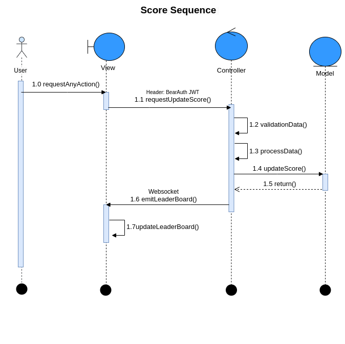

# README - API Scoreboard

## Introduction
API Scoreboard is a system that provides a real-time user ranking scoreboard. The system supports score updates, leaderboard retrieval, and fraud prevention mechanisms.

## Key Features
- Displays the top 10 users with the highest scores.
- Real-time score updates using WebSocket.
- JWT authentication for API security.
- Redis caching for performance optimization.
- Anti-cheating mechanisms: Rate limiting, score update validation.

## System Architecture
- **Backend**: NestJS + MongoDB + Redis.
- **Realtime Update**: Uses WebSocket (Socket.IO).
- **Security**: JWT authentication, API spam protection.

## API Usage Guide

### 1. Update Score
- **Endpoint**: `POST /api/score/update`
- **Header**: `Authorization: Bearer <token> (JWT authentication token)`
- **Request**:
  ```json
  {
    "userId": "string",
    "score": "number"
  }
  ```
- **Response**:
  - `200 OK`: Successfully updated.
  - `400 Bad Request`: Invalid data.
  - `400 Not Found`: User not found.
  - `401 Unauthorized`: User is not authorized.
  - `500 Internal Server Error`: System error.

### 2. Get Leaderboard
- **Endpoint**: `GET /api/score/leaderboard`
- **Response**:
  ```json
  {
    "leaderboard": [
      { "userId": "123", "score": 1500 },
      { "userId": "456", "score": 1400 }
    ]
  }
  ```

## Suggested Improvements
- **Prevent replay attacks**: Include a timestamp and hash in the request.
- **Store score history**: Track score changes for each user.
- **Support distributed architecture**: Use Kafka or RabbitMQ for system scalability.
- **Validate score increase logic**: Limit the maximum score gain per action.
- **Verify JWT validity**: Ensure API and WebSocket token verification.

## diagram 

-**Score Sequence diagram**: Along with the README file, I have also created a Score Sequence diagram to illustrate how the system operates. You can check the file 


